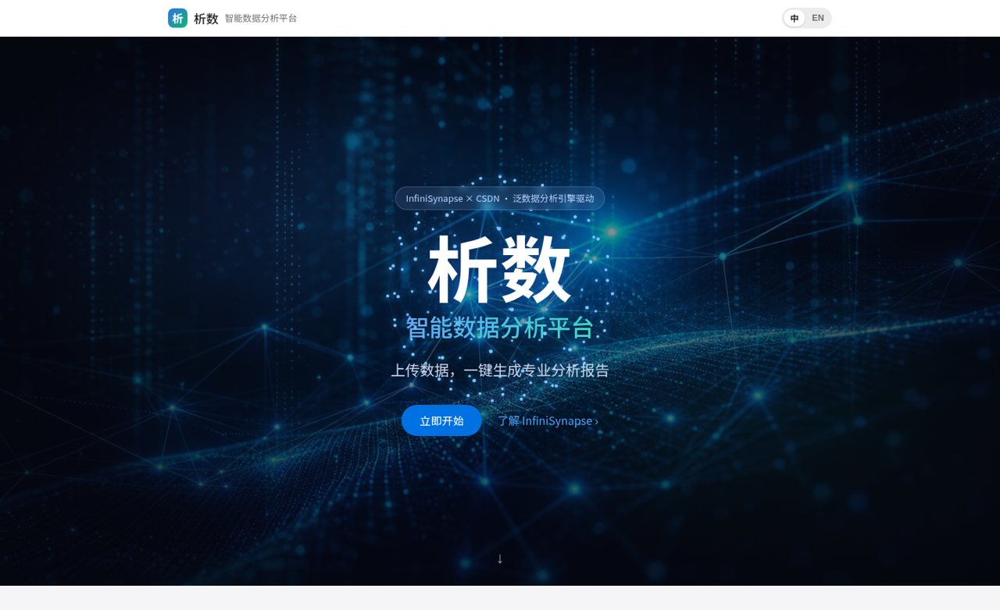
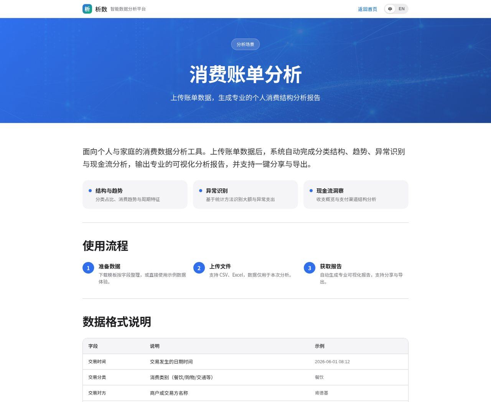
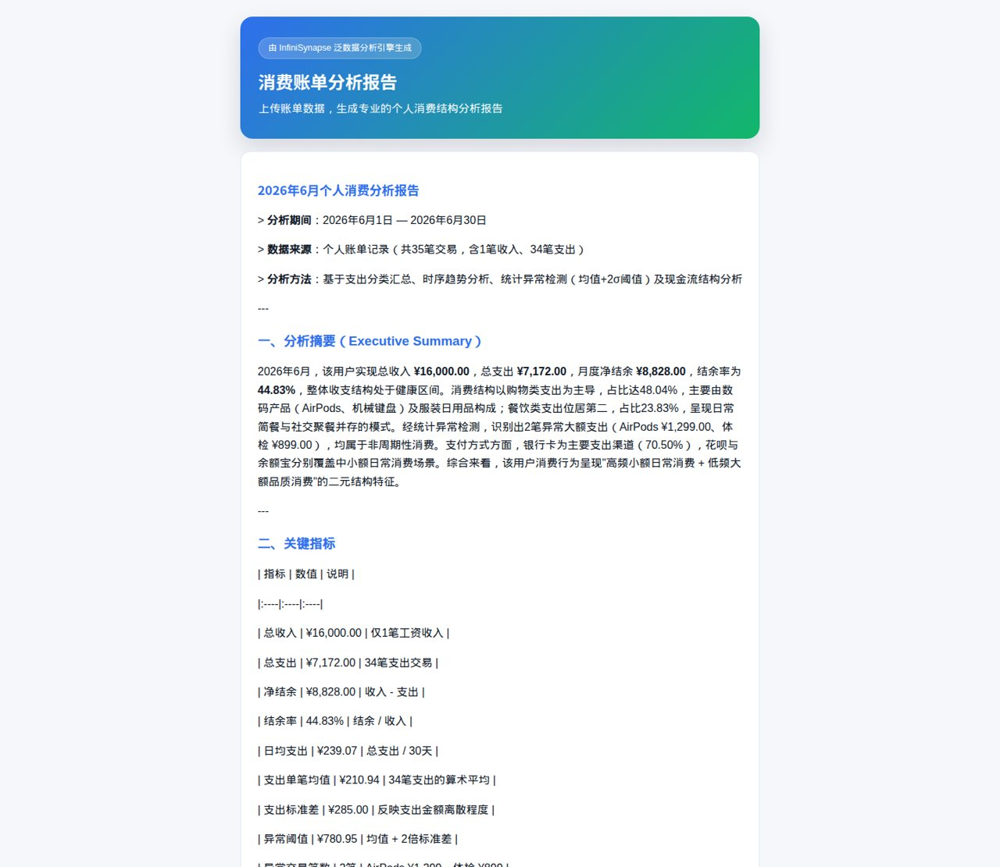
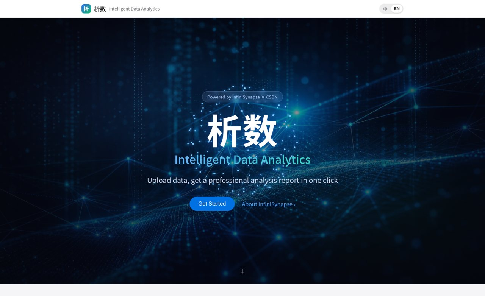

# 析数 · 智能数据分析平台 · Analyx

> InfiniSynapse × CSDN「Vibe Coding 泛数据分析应用开发大赛」参赛作品
>
> 上传数据，一键生成专业分析报告 —— 无需 SQL 或代码。

**在线体验 / Live**: **https://www.lgbisha.cn** （右上角可切换中/英文，`?lang=en` for English）



<p align="center">
  <a href="https://infinisynapse.cn">
    
  </a>
  
  
  
</p>

---

## 简介

析数是基于 **InfiniSynapse 泛数据分析引擎** 构建的智能数据分析平台。用户上传自己的数据，由 AI 自动完成建表、指标计算、可视化与专业报告输出，并支持在线分享与 PDF 导出。

内置**四大**高频决策场景：

| 场景 | 说明 |
|---|---|
| 💳 消费账单分析 | 上传微信/支付宝账单，分析消费结构、趋势、大额异常与现金流 |
| ❤️ 健康数据分析 | 上传每日健康记录，分析指标趋势、相关性与健康预警 |
| 📈 投资持仓分析 | 上传持仓与交易流水，分析资产结构、收益归因与风险敞口 |
| 📉 股票走势分析 | 上传日线 OHLCV，技术指标 + 支撑压力 + 量化策略回测参考（不构成投资建议） |

每个场景均提供**数据模板下载**、**示例数据一键体验**与**示例报告预览**，无需注册即可跑通「上传 → 分析 → 图表 → 报告 → 分享」全流程。

## 界面预览 / Screenshots

| 分析场景页 | 专业分析报告 |
|---|---|
|  |  |

| 英文界面 (English UI) |
|---|
|  |

## 亮点

- **专业报告**：分析摘要 → 关键指标 → 分维度分析 → 关键发现 → 优化建议的固定结构，客观书面、数据支撑
- **可视化**：引擎自动生成 SVG 图表（柱状图/饼图/折线图）
- **传播闭环**：每份报告一键生成带品牌的**公开分享页** + **PDF 导出**
- **体验**：Apple 风沉浸式首页、3D 数据粒子动效、中英文一键切换、移动端适配

## 技术架构

```
apps/
  server/   Node.js + Fastify + TypeScript —— InfiniSynapse Server API 客户端、任务编排、SSE 转发、公开分享页
  web/      React + Vite + TypeScript —— 单页应用，配置驱动三场景，纯 canvas 3D 粒子球
```

**API Key 仅存服务端环境变量，前端零接触。**

## InfiniSynapse Server API 集成

后端通过 InfiniSynapse Server API 完成全部分析能力（所有调用可在 `app.infinisynapse.cn/tasks` 后台查验）：

1. **发起分析** — `GET /api/ai/events`（SSE 订阅）+ `POST /api/ai/message`（`type=newTask`，`chatSettings.mode=act`），客户端预生成唯一 taskId 保证并发安全
2. **实时进度** — 消费 SSE 的 `message.partial` / `completion_result`，向浏览器流式推送分析阶段
3. **产物获取** — `GET /api/ai_task/getTaskWorkspace/:id` + `POST /api/ai_task/previewFile` 拉取 SVG 图表、结构化数据与 Markdown/PDF 报告
4. **公开分享** — `POST /api/ai_task/setShare` + `GET /api/ai_task/publicTask` / `publicPreviewFile` 生成免登录分享页

数据接入：上传的 CSV/Excel 经服务端解析后内联进任务，由引擎自动加载建表、执行 SQL、统计建模与可视化。

## 本地运行

```bash
# 1) 后端
cd server
cp .env.example .env      # 填入你的 INFINI_API_KEY
npm install
npm start                 # 监听 PORT（默认 30080）

# 2) 前端（开发）
cd ../web
npm install
npm run dev               # Vite dev server，代理 /api 到后端

# 生产：前端 npm run build 后，后端自动托管 web/dist
```

## 部署

- 前端构建为静态资源由 Fastify 托管；生产用 pm2 常驻，nginx 反代 + HTTPS。
- 单进程支持全部三场景（`?scenario=` 区分），中英文由 `?lang=` 区分。

---

## 🚀 关于 InfiniSynapse × CSDN

本作品由 **[InfiniSynapse](https://infinisynapse.cn) 泛数据分析引擎** 驱动，参加 **InfiniSynapse × CSDN 联合主办的「Vibe Coding 泛数据分析应用开发大赛」**。

**InfiniSynapse** 让 AI 直接理解自然语言、连接各类数据源（数据库 / Excel / 文档），完成从数据查询、分析到洞察的全流程——**让不懂 SQL 和代码的人也能做专业的数据分析**。一个 API Key 即可通过 Server API 编程发起分析任务、管理数据源与知识库、获取图表与报告。

- 🌐 官网 & 在线体验：https://infinisynapse.cn
- 🔑 注册即送 500 积分并申请 API Key：https://app.infinisynapse.cn
- 📖 Server API 文档：https://infinisynapse.cn/zh/docs/InfiniSynapse%20Server%20API%20Reference
- 🏆 Vibe Coding 大赛：https://infinisynapse.cn/contest/vibe-coding

> 想做自己的泛数据分析应用？注册 InfiniSynapse，用 Vibe Coding 的方式，几百行代码就能把 AI 数据分析能力接进你的产品。

---

*Powered by InfiniSynapse × CSDN. 分析能力由 InfiniSynapse 泛数据分析引擎驱动。*
